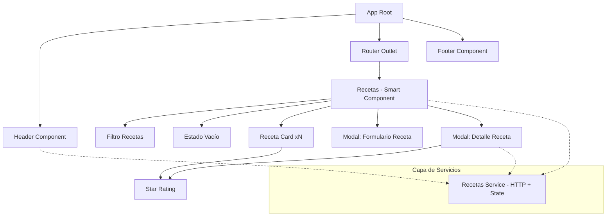

# 🍳 Gestor de Recetas

Una Single Page Application (SPA) desarrollada con Angular 18+ para gestionar, visualizar, filtrar y valorar recetas de cocina. Implementa características modernas del framework: Standalone Components, Signals, Control Flow Syntax (@if, @for) y programación reactiva con RxJS.

---

## Resumen rápido

- Framework: Angular 18+ (Standalone Components)
- Estado: CRUD completo (Create, Read, Update -votos-, Delete) funcional con persistencia en db.json mediante json-server.
- Mock API: json-server (puerto por defecto: 3000)
- Autor: Iván Carrillo Vela | Desarrollo de Interfaces

---

## Composición del repositorio

Este repositorio está compuesto mayoritariamente por TypeScript, HTML y SCSS, lo que refleja una aplicación Angular clásica: lógica y tipos en TypeScript, vistas en HTML y estilos en SCSS.

---

## Tabla de contenidos

- [Arquitectura y patrones](#arquitectura-y-patrones)
- [Diagrama de componentes](#diagrama-de-componentes)
- [Componentes y responsabilidades](#componentes-y-responsabilidades)
- [Flujo de datos y estado](#flujo-de-datos-y-estado)
- [Tecnologías](#tecnologías)
- [Instalación y ejecución](#instalación-y-ejecución)
- [Estructura del proyecto (orientativa)](#estructura-del-proyecto-orientativa)
- [Buenas prácticas y sugerencias](#buenas-prácticas-y-sugerencias)
- [Contacto](#contacto)

---

## Arquitectura y patrones

La aplicación sigue una arquitectura basada en componentes con separación clara entre:

- Smart/Container Components: contienen la lógica (por ejemplo, `Recetas`) y orquestan la carga/filtrado/modal.
- Dumb/Presentational Components: puramente visuales (por ejemplo, `RecetaCard`, `StarRating`, `Filtro`, `EstadoVacio`) — reciben inputs y emiten outputs.
- Capa de Servicios: `RecetasService` como única fuente de la verdad (Mediator pattern), expone streams y subjects para actualizar la UI tras cambios.

Patrones clave utilizados:
- Container/Presentation (Smart vs Dumb)
- MVVM reactivo (ViewModel con RxJS — vm$ consumido con AsyncPipe)
- Mediator (servicio central con ReplaySubject/Subject)
- Uso de Signals y nueva sintaxis de control de flujo en plantillas (@if, @for)

---

## Diagrama de componentes



---

## Componentes y responsabilidades

1. Core & Layout
   - AppComponent: raíz; monta Header, RouterOutlet y Footer.
   - Header: controla la apertura global del formulario de creación.
   - Footer: pie de página con año calculado dinámicamente.

2. Vistas principales (Smart)
   - Recetas:
     - Carga inicial de datos.
     - Combina filtros (texto y estrellas) con `combineLatest`.
     - Exposición de vm$ (ViewModel) consumido por la plantilla.
     - Control de modales (detalle y formulario).

3. Componentes funcionales (Dumb)
   - RecetaCard: muestra imagen, título y StarRating. Emite eventos: borrar, votar, ver detalle.
   - RecetaDetalle: carga por ID al inicializarse; diseño responsive tipo "Hero".
   - RecetaForm: Reactive Forms; validaciones; procesa ingredientes multilínea → array.
   - Filtro: input estilizado que emite texto en tiempo real.
   - StarRating: modo readonly / votación; visualiza estrellas llenas/vacías.
   - EstadoVacio: feedback cuando no hay datos o filtros no devuelven resultados.

---

## Flujo de datos y estado

- RecetasService:
  - HTTP para comunicarse con json-server.
  - Exposición de streams/subjects (por ejemplo, `changesOnRecetas$`, Subjects para apertura de modales desde Header).
  - Uso de ReplaySubject para notificar cambios tras create/delete/vote.
- En `Recetas`:
  - Uso de `BehaviorSubject` o signals para filtros.
  - `combineLatest` para combinar recetas + filtros y construir `vm$`.
  - La vista consume `vm$` con `AsyncPipe` para evitar suscripciones manuales.
- En componentes hoja (RecetaCard, RecetaDetalle):
  - Uso de Signals (`signal<T>`, `input.required<T>`) para reactividad fina.
  - Plantillas con `@if` y `@for` cuando procede.

---

## Tecnologías

- Angular 18+ (Standalone Components)
- TypeScript
- RxJS (Observables, Subjects, Operators)
- SCSS para estilos
- Bootstrap 5 (instalado via npm)
- Bootstrap Icons
- json-server para mock REST API
- Herramientas comunes: Node.js, Angular CLI, npm

---

## Instalación y ejecución

Estas instrucciones permiten levantar el entorno completo sin necesidad de añadir información extra.

1. Clona el repositorio (si no lo has hecho ya)
   ```bash
   git clone https://github.com/ivancarrillovela/PaginaRecetas.git
   cd PaginaRecetas
   ```

2. Instala dependencias
   ```bash
   npm install
   ```

3. Inicia el Mock Backend (db.json)
   - En una terminal aparte:
   ```bash
   npx json-server db.json --watch --port 3000
   ```
   - Nota: La API espera estar disponible en http://localhost:3000

4. Inicia la aplicación Angular
   - En otra terminal:
   ```bash
   ng serve
   ```
   - Abre: http://localhost:4200

5. Flujo recomendado durante desarrollo
   - Mantén dos terminales: uno con json-server y otro con ng serve.
   - Si necesitas datos iniciales, edita `db.json` y reinicia `json-server` o usa la opción `--watch`.

---

## Scripts útiles (orientativo)

Si tu package.json incluye scripts típicos de Angular, usa:
- `npm run start` o `ng serve` — levantar app
- `npm run build` o `ng build` — compilar producción
- `npm run lint` — linter (si está configurado)
- `npm test` — tests unitarios (si están configurados)

(Verifica `package.json` para confirmar los scripts exactos del proyecto.)

---

## Estructura del proyecto (orientativa)

- src/
  - app/
    - core/ (servicios, modelos)
    - components/ (RecetaCard, StarRating, Filtro, EstadoVacio, etc.)
    - pages/ (Recetas)
    - app.component.* (App root)
  - assets/
  - styles/ (SCSS global)
- db.json (mock DB usada por json-server)

---

## Buenas prácticas y sugerencias futuras

- Añadir pruebas unitarias (Jest o Karma + Jasmine) y E2E (Cypress).
- Integrar CI (GitHub Actions) para builds y tests.
- Añadir un pipeline de linters y formateadores (ESLint, Prettier).
- Considerar migración del mock a un backend real manteniendo los contratos HTTP.
- Añadir paginación y carga perezosa para grandes volúmenes de recetas.
- Añadir internacionalización (i18n) si se planea soporte multi-idioma.

---

## Contribuciones

Si quieres colaborar:
1. Haz fork y crea una rama con tu feature/bugfix.
2. Asegúrate de ejecutar las pruebas locales y linters.
3. Abre un Pull Request con descripción clara de cambios y motivos.

---

## Contacto

Desarrollado por Iván Carrillo Vela | Desarrollo de Interfaces  
GitHub: https://github.com/ivancarrillovela
